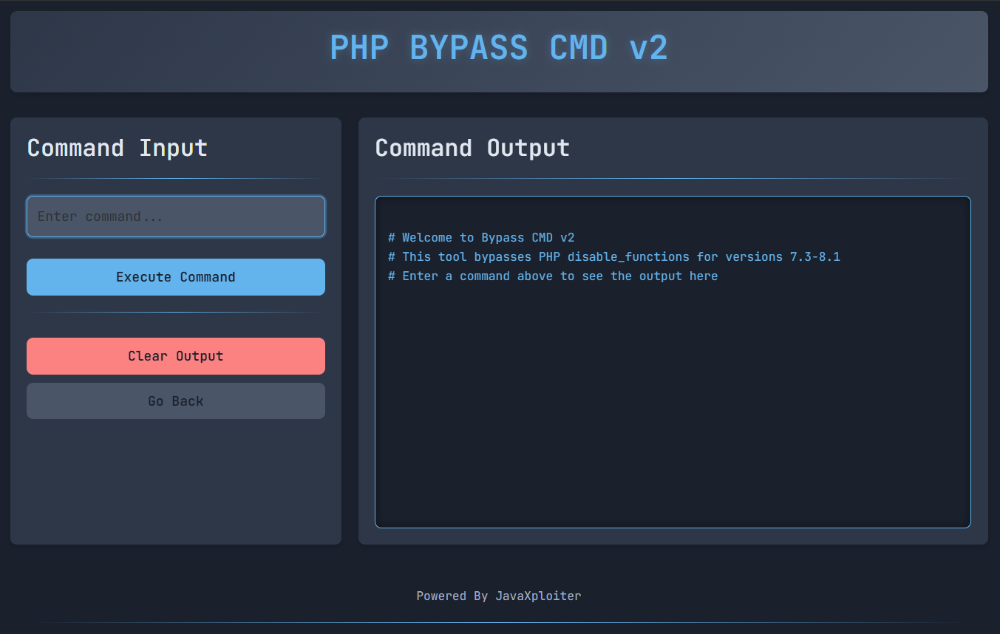

# PHP disable_functions Bypass Exploit (CVE-2022-XXXXX)


## 📖 Overview

A proof-of-concept exploit that bypasses PHP's `disable_functions` restriction for PHP versions 7.3 through 8.1. This tool leverages a vulnerability in PHP's memory management to execute arbitrary system commands even when critical functions are disabled.

> **⚠️ Disclaimer**: This tool is intended for educational and authorized penetration testing purposes only. Use responsibly and only on systems you own or have explicit permission to test.

## 🚀 Features

- **Bypass disable_functions**: Execute system commands despite PHP security restrictions
- **Web Interface**: User-friendly web-based interface for command execution
- **Multiple PHP Version Support**: Works with PHP 7.3, 7.4, 8.0, and 8.1
- **Professional UI**: Clean, responsive interface with real-time output
- **Memory Exploitation**: Utilizes PHP UAF (Use-After-Free) vulnerability

## 🔧 Technical Details

### Affected Versions
- PHP 7.3.x
- PHP 7.4.x  
- PHP 8.0.x
- PHP 8.1.x (early versions)

### Vulnerability
This exploit targets a memory corruption vulnerability in PHP's garbage collection mechanism, allowing attackers to bypass `disable_functions` directives and execute arbitrary commands.

### Technical Implementation
The exploit works by:
1. Leveraging PHP's string concatenation vulnerability
2. Creating controlled memory corruption through UAF
3. Overwriting function handlers to point to system()
4. Executing commands with the compromised function handler

## 📦 Installation

### Method 1: Direct Upload
```bash
# Clone the repository
git clone https://github.com/JawaTengahXploit1337/PHPCommandBypass
cd PHPCommandBypass

# Upload the PHP file to your target server
cp cmdbyp.php /var/www/html/cmdbyp.php
```

### Method 2: Wget & Curl Files (Alternative)
```bash
wget https://raw.githubusercontent.com/JawaTengahXploit1337/PHPCommandBypass/main/cmdbyp.php
```
```bash
curl -O https://raw.githubusercontent.com/JawaTengahXploit1337/PHPCommandBypass/main/cmdbyp.php
```

## 🛠 Usage

### Web Interface
1. Upload `cmdbyp.php` to your target server
2. Access the file via web browser: `http://target.com/cmdbyp.php`
3. Enter commands in the input field
4. View results in the output panel

### Direct PHP Execution
```php
<?php
include 'cmdbyp.php';
// The exploit auto-executes when accessed via web interface
?>
```

## 🎯 Example Commands

```bash
# System information
whoami
uname -a
pwd

# File operations
ls -la
cat /etc/passwd
find / -name "config.php" 2>/dev/null

# Network information
ifconfig
netstat -tuln
```

## 📋 Prerequisites

- **PHP Version**: 7.3, 7.4, 8.0, or 8.1
- **Operating System**: Linux (x86/x64)
- **Web Server**: Apache/Nginx with PHP support
- **Permissions**: Write access to web directory

## 🔒 Security Considerations

### For Defenders
- Upgrade to PHP 8.2+ where this vulnerability is patched
- Implement proper input validation and filtering
- Use additional security layers like WAF
- Regularly update PHP installations

### For Testers
- Use only in authorized environments
- Obtain proper permissions before testing
- Follow responsible disclosure practices
- Remove exploit files after testing

## 🏗 Project Structure

```
php-disable-functions-bypass/
│
├── cmdbyp.php          # Main cmdbypass file
├── README.md           # This documentation
├── LICENSE            # MIT License
└── examples/          # Usage examples
    ├── basic-usage.php
    └── advanced.md
```

## 🤝 Contributing

Contributions are welcome! Please feel free to submit pull requests or open issues for discussion.

### Development Setup
```bash
git clone https://github.com/JawaTengahXploit1337/PHPCommandBypass.git
cd PHPCommandBypass

# Set up testing environment
docker run -it -v $(pwd):/var/www/html -p 8080:80 php:7.4-apache
```

## 📜 License

This project is licensed under the MIT License - see the [LICENSE](LICENSE) file for details.

## 🙏 Acknowledgments

- Original research by [mm0r1](https://github.com/mm0r1)
- PHP Security Team for vulnerability disclosure
- Security researchers who contributed to the understanding of this vulnerability

## ⚠️ Legal Notice

This software is provided for educational purposes only. The authors are not responsible for any misuse or damage caused by this program. Users are expected to comply with all applicable laws and regulations.

## 📞 Support

For questions or issues:
- Open an issue on GitHub
- Check existing discussions in Issues section
- Ensure you've read the documentation thoroughly

## 🔄 Changelog

### v2.0 (Current)
- Enhanced web interface with Bootstrap 5
- Improved error handling
- Better cross-version compatibility
- Professional UI/UX design

### v1.0
- Initial proof-of-concept
- Basic command execution
- Functional web interface

---

**Disclaimer**: This tool should only be used for legitimate security testing purposes with proper authorization. Unauthorized use may violate laws and regulations.
